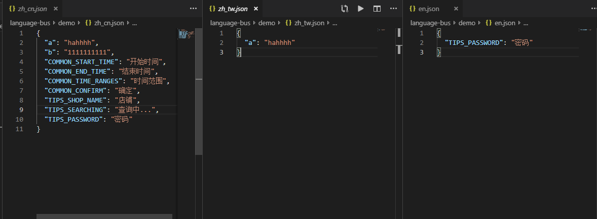
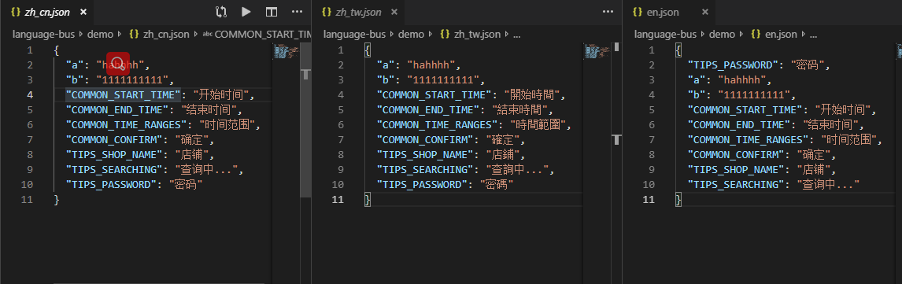

## language-bus
解决多语言配置时，总是需要复制粘贴的痛点(将来源json中，目标json不存在的key添加到目标json中)

### configuration
+ 定义在package.json中(路径仅做参考，实际实用以自己项目路径为准)
``` json
  "language": "node index.js"
```
+ 命令行执行
``` shell
  npm run language
```
### Useage
+ 传参格式：
``` javascript
  [{path: 'a.json', transfer: func}, 'b.json']
    || {path: 'c.json'}
    || 'd.json'
  // transfer 为可选项，若不传，则只会扩充目标json文件
```
<em><strong>e.g.</strong></em>
``` javascript
  const LanguageBus = require('./language-bus/index');
  // 初始化(指定来源json)
  const lanBus = new LanguageBus({origin_path: 'zh_cn.json'});

  // 将str转成繁体
  function toComplexChiese (str) {
    // do something.
    return str;
  }

  const targets = [
    {
      path: 'zh_tw.json',
      transfer: toComplexChiese
    },
    'en.json'
  ];

  // writeFiles 函数中传入需要扩充的目标json
  lanBus.writeFiles(targets);
  // lanBus.writeFiles('franch.json');
```

### demo
转换前：

转换后：
